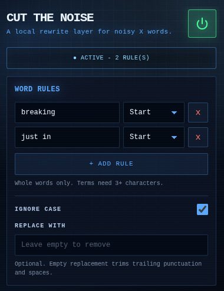

# Cut the Noise

Cut the Noise is a small Chrome extension for making X feel less frantic. It rewrites noisy words and phrases in post text, then tones down promoted posts so your timeline is easier to scan.

  

## What It Does

- Removes or replaces words and phrases like `breaking`, `just in`, or any other term you choose.
- Lets each rule match either anywhere in text or only at the start of a post.
- Matches whole words only, so short fragments do not accidentally rewrite unrelated words.
- Supports case-insensitive matching.
- Can visually compress and mute promoted posts without deleting them from the page.
- Runs only on `https://x.com/*`.

## How It Works

The content script walks text nodes on X and applies your saved word rules. A `MutationObserver` watches the timeline as new posts load, so rewrites continue while you scroll.

When the replacement field is empty, matching terms are removed and nearby trailing punctuation or spacing is cleaned up. When a replacement is provided, matched terms are swapped for that text.

Promoted posts are detected from X's placement tracking markup. Instead of hiding them, the extension can compress their height, reduce their visual intensity, and optionally apply a red tint so they are easy to skip.

Settings are stored with `chrome.storage.sync`, and the popup notifies active X tabs when you change a rule so updates apply immediately.

## Install From Source

1. Download or clone this repository.
2. Open Chrome or another Chromium-based browser.
3. Go to `chrome://extensions`.
4. Enable `Developer mode`.
5. Click `Load unpacked`.
6. Select this repository folder.
7. Open `https://x.com` and click the extension icon to configure rules.

## Settings

| Setting | Description |
| --- | --- |
| Word rules | Terms or phrases to remove or replace. Rules need at least 3 characters. |
| Scope | `Start` matches the beginning of text. `Anywhere` matches any whole-word occurrence. |
| Ignore case | Treats uppercase and lowercase matches as the same. |
| Replace with | Replacement text. Leave empty to remove the matched term. |
| Tone down promoted posts | Compresses and desaturates promoted posts. |
| Apply red tint | Adds a visible tint to promoted posts. |

## Privacy

Cut the Noise does not send browsing data anywhere. It runs locally in your browser and only stores your extension settings through Chrome sync.

## Project Files

- `manifest.json` declares the Manifest V3 extension, permissions, popup, icons, and X content script.
- `content.js` rewrites text, observes timeline changes, and tones down promoted posts.
- `popup.html` and `popup.js` provide the settings UI.
- `background.js` manages the toolbar icon's active indicator.
